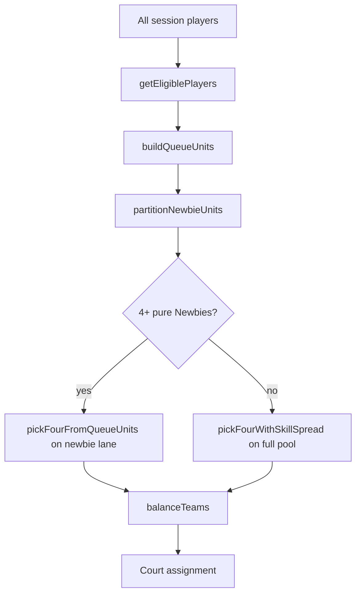

# Matching engine

Technical reference for how SisClub Open Play picks players from the queue and assigns teams. Implementation lives in:

- [`src/lib/queue/queue-engine.ts`](../src/lib/queue/queue-engine.ts) — selection, team balancing, scoring
- [`src/lib/player-partners.ts`](../src/lib/player-partners.ts) — partner units, queue ordering
- [`src/lib/queue/wait-time.ts`](../src/lib/queue/wait-time.ts) — wait-time calculation

## Overview



When a court opens (manual assign or auto-assign after a match), the engine:

1. Builds the **eligible queue**
2. Splits **Newbie** players into a protected lane when possible
3. Picks **4 players** (respecting partners and skill rules)
4. Splits them into **Team A** and **Team B**

## Who is in the queue?

Only players who are:

- `isActive === true`
- Status **`Present`** or **`Waiting`**

Checked-in players move to `Present` at check-in; after a match they typically return to `Waiting` with an updated `gamesPlayed` and `lastPlayedAt`.

Players who are `Registered`, `Secured`, `Waitlisted`, `Playing`, etc. are **not** in the assignment pool.

## Queue priority (fair order)

Eligible players are sorted by [`compareQueuePriority`](../src/lib/queue/queue-engine.ts):

| Priority | Field | Rule |
|----------|-------|------|
| 1 | `gamesPlayed` | Fewer games played = closer to front |
| 2 | Wait time | Longer wait = closer to front |
| 3 | (implicit) | Stable sort preserves earlier join order when tied |

**Wait time** starts from `lastPlayedAt` if set (time since last game ended), otherwise `checkedInAt` ([`waitingSinceTimestamp`](../src/lib/queue/wait-time.ts)).

## Partner handling

### Mutual partners

A **mutual partner link** exists when player A's `partnerId` is B **and** B's `partnerId` is A.

### Queue ordering

[`orderQueueForPartners`](../src/lib/player-partners.ts) moves the higher-priority partner down so they sit **next to** their partner in the queue (partners should not be separated by unrelated players).

### Queue units

[`buildQueueUnits`](../src/lib/player-partners.ts) converts the ordered queue into **units**:

- Solo player → unit of 1
- Mutual partner pair → unit of 2 (inseparable)

Assignment always picks **whole units** — a partner pair is never split across different courts.

### Team assignment with partners

[`balanceTeams`](../src/lib/queue/queue-engine.ts) after picking 4 players:

| Partner layout | Team split |
|----------------|------------|
| 2 mutual pairs | Each pair = one team |
| 1 mutual pair + 2 solos | Best split that keeps the pair together and balances skill/gender |
| No partners | Skill + gender optimized split (see below) |

## Newbie protected lane

Skill level **`Newbie`** is for true first-timers (no racket sport experience).

| Rule | Behavior |
|------|----------|
| Newbie unit | Solo Newbie, or mutual pair where **both** are Newbie |
| Mixed pair | e.g. Newbie + Beginner → **main lane** (not newbie-only) |
| 4+ Newbies waiting | Next court picks **only** from newbie units (FIFO within lane) |
| 1–3 Newbies waiting | Newbies **spill into main pool** for that assignment |

Spillover means a Newbie may be matched with more experienced players when there aren't enough Newbies to fill a court. Organizers can delay assignment or adjust skill on the roster.

## Win/loss record brackets

After each finished match, players get `wins` / `losses` tallies on their session row ([`finishMatchRecord`](../src/utils/supabase/queries.ts)).

[`pickFourWithRecordMatching`](../src/lib/queue/queue-engine.ts) groups players by **record tier** before skill spread:

| Tier | Rule |
|------|------|
| **winning** | More wins than losses |
| **losing** | More losses than wins |
| **even** | Wins equal losses |
| **unplayed** | No finished matches yet |

Priority when filling a court (main pool): **winning → losing → even → unplayed**, then mixed units. Within a tier, the same skill-spread rules apply. Goal: winners face winners, rebuild bracket for players coming off losses.

Partner units with mixed records go to the **mixed** pool.

## Main pool skill matching

When not filling a newbie-only court, [`pickFourWithSkillSpread`](../src/lib/queue/queue-engine.ts) searches all queue units for a valid group of 4.

**Skill ladder** ([`SKILL_NUMERIC`](../src/lib/constants.ts)):

| Level | Value |
|-------|-------|
| Newbie | 0 |
| Beginner | 1 |
| Novice | 2 |
| Intermediate Low | 3 |
| Intermediate High | 4 |
| Advanced | 5 |

**Spread** = max skill value − min skill value among the 4 players.

Session setting **`skillMatchingMode`** ([`maxSkillSpreadForMode`](../src/lib/queue/queue-engine.ts)):

| Mode | Max spread | Effect |
|------|------------|--------|
| **Strict** | 1 | Tight groups only; may block assignment if no valid group |
| **Balanced** | 2 | Default; reasonable mix |
| **Flexible** | 3 | Fills courts faster; wider skill range allowed |

Among valid groups, the engine prefers the one that uses **earlier queue units** (lower index sum = fewer skips at the front).

If no group satisfies the spread limit, assignment returns `null` (organizer sees "not enough eligible players" or similar).

## Team balancing (within the 4)

After 4 players are chosen, [`balanceTeams`](../src/lib/queue/queue-engine.ts) assigns Team A vs Team B:

1. **Partner rules** (above) take precedence when mutual pairs exist.
2. Otherwise, players are sorted by skill (highest first) and the engine tries 3 possible 2v2 splits.
3. Each split is scored:
   - **Skill balance**: `|avgSkill(teamA) − avgSkill(teamB)| × 2` (lower is better)
   - **Gender mix**: mixed-gender doubles preferred on each team (lower penalty is better)

Gender tiers use [`getCompetitiveGenderTier`](../src/lib/player-gender.ts) (`male`, `female`, `unknown`).

## Key exports

| Function | Purpose |
|----------|---------|
| `getEligiblePlayers` | Filtered, sorted queue |
| `selectNextFourPlayers` | Pick next 4 for a court |
| `createNextMatchForCourt` | Pick 4 + balance teams; sets `isNewbieCourt` |
| `previewNextMatch` | Same as above, for admin "next up" UI |
| `getQueuePosition` | 1-based position for a player in eligible queue |
| `countNewbiesInQueue` | Count Newbies in eligible queue (UI) |
| `validateMatchScore` | Score validation (target score, win-by) |

## Session settings that affect matching

From session record / admin Settings tab:

| Setting | Effect |
|---------|--------|
| `skillMatchingMode` | Strict / Balanced / Flexible spread for main pool |
| `autoAssignNextMatch` | Auto-assign when a court clears after a match |
| `allowUnpaidInQueue` | Whether unpaid players can enter queue (payment sessions) |
| `targetScore`, `winBy` | Scoring rules (not selection, but match flow) |

## Tests

Unit tests: [`src/lib/queue/queue-engine.test.ts`](../src/lib/queue/queue-engine.test.ts)

```bash
npm run test
```

Cases covered: newbie-only selection, spillover, mixed partner pairs, strict spread rejection, newbie court flag.

## Related docs

- [Open Play Guide for players](./OPEN-PLAY-GUIDE.md) — plain-language summary to share with guests
